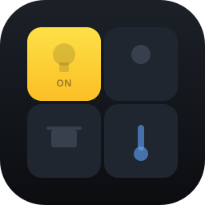
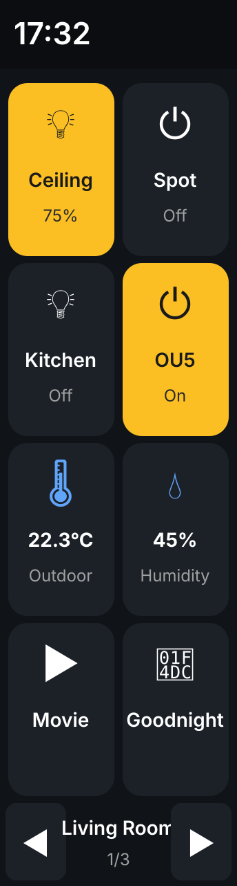
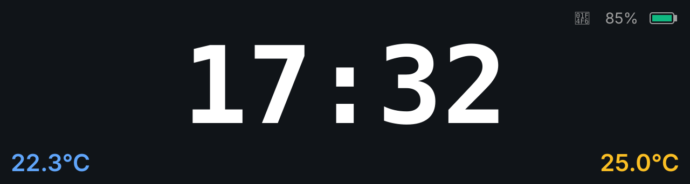

<p align="center">
  
</p>

# Home Assistant Touch Panel — Waveshare ESP32-S3-Touch-LCD-3.49

A Home Assistant custom integration **plus** ESPHome firmware that turns the
Waveshare 3.49" portrait touch LCD into a fully dynamic, multi-page smart-home
control panel — all configurable from the HA UI without re-flashing.


<p align="center">
  
  &nbsp;&nbsp;
  
</p>

## Demo

<p align="center">
  <video src="docs/homeassistant-waveshare-lcd349.mp4" controls width="400">
    Your browser doesn't render embedded video.
    <a href="docs/homeassistant-waveshare-lcd349.mp4">Download the demo</a>.
  </video>
</p>

> If the video doesn't load inline, [click here to download](docs/homeassistant-waveshare-lcd349.mp4).

## Features

- **HA-native configuration** — add pages and entities from a HA UI form, no
  reflashing needed
- **Multi-page** — up to 50 pages, 8 slots per page, swipe or tap to navigate
- **Auto-dispatched actions** — single service handles `light`, `switch`,
  `scene`, `script`, `input_boolean`, `automation`, `fan`, `cover`,
  `media_player`
- **Sensor display slots** — `sensor` and `binary_sensor` entities show their
  live value with auto-formatted units (`22.3°C`, `45%`, …)
- **Domain-aware MDI icons** — lightbulb, switch, thermometer, water-percent,
  flash, fan, shutter, motion, etc.
- **Smart state sync** — buttons turn yellow when entity is on, gray when off;
  lights show their brightness (`75%`); covers show position
- **Auto rotation** — IMU detects portrait vs landscape, switches between the
  remote view and a clock+temperature dashboard
- **Battery operation** — 18650 with hardware power latch, live voltage and %,
  color-coded battery bar (green/yellow/red)
- **Two-finger gestures** — horizontal swipe = page change, no accidental
  button presses thanks to motion-aware click guard
- **Multi-language ready** — English default, Turkish included

## Hardware

[**Waveshare ESP32-S3-Touch-LCD-3.49**](https://www.waveshare.com/wiki/ESP32-S3-Touch-LCD-3.49)

- ESP32-S3 (16 MB flash, octal PSRAM)
- 172×640 AXS15231B QSPI display + capacitive touch
- QMI8658 6-axis IMU
- PCF85063 RTC
- TCA9554 IO expander (power latch on pin 6)
- I2S audio codec (TDM mode)
- 18650 battery slot with charging circuit + ADC voltage sense
- 2 GPIO buttons (BOOT + PWR)

## Quick Start

### 1. Clone

```bash
git clone https://github.com/cryptooth/homeassistant-waveshare-lcd349.git
cd homeassistant-waveshare-lcd349
```

### 2. Install the Home Assistant integration

**Manual:**

```bash
cp -r custom_components/touch_panel_manager <HA_CONFIG>/custom_components/
# Then restart Home Assistant
```

**Via HACS:**

1. HACS → Integrations → ⋮ → **Custom repositories**
2. URL: `https://github.com/cryptooth/homeassistant-waveshare-lcd349`,
   Category: **Integration**
3. Install **Touch Panel Manager**, restart HA

### 3. Add a panel device in HA

**Settings → Devices & Services → Add Integration → "Touch Panel Manager"**.
Give it a name (e.g. *Living Room Panel*).

This creates one device with several entities:

- `sensor.<name>_config` — config attributes consumed by ESPHome
- `sensor.<name>_outdoor_temp` / `_indoor_temp` — proxies for chosen sensors
- `binary_sensor.<name>_slot_1_state` … `_slot_8_state` — per-slot on/off

### 4. Configure pages

Open the device → **Configure** → menu:

- ➕ **Add a new page** — title + 8 entity slots
- ✏️ **Edit** existing page
- 🗑️ **Delete** page
- 🌡️ **Temperature sensors** — outdoor/indoor for dashboard
- ✅ **Save & close**

### 5. Prepare ESPHome

Install ESPHome (recommended: virtualenv):

```bash
python3 -m venv .venv
source .venv/bin/activate
pip install esphome
```

Create your `secrets.yaml`:

```bash
cp secrets.yaml.example secrets.yaml
# Edit: WiFi SSID/password, OTA password, API encryption key
```

Generate the API encryption key:

```bash
python3 -c "import secrets,base64; print(base64.b64encode(secrets.token_bytes(32)).decode())"
```

### 6. Update entity IDs in YAML

Edit `waveshare-lcd349-controller.yaml`, find the `substitutions:` block and
match your HA device's entity IDs:

```yaml
substitutions:
  panel_config_entity:  "sensor.touch_panel_config"
  panel_outdoor_proxy:  "sensor.touch_panel_outdoor_temp"
  panel_indoor_proxy:   "sensor.touch_panel_indoor_temp"
```

You can find these in **Developer Tools → States**, filter by `touch_panel`.

### 7. Download the MDI font

```bash
mkdir -p fonts
curl -o fonts/materialdesignicons.ttf \
  https://cdn.jsdelivr.net/npm/@mdi/font@latest/fonts/materialdesignicons-webfont.ttf
```

### 8. Flash

Plug the device into USB-C (use the port labelled **USB**, not UART):

```bash
esphome run waveshare-lcd349-controller.yaml
```

Subsequent updates can use OTA over WiFi.

### 9. Confirm in HA

After boot, HA auto-discovers the device under the ESPHome integration. Accept
and paste the encryption key from your `secrets.yaml`.

You should now see your buttons populated from the config!

## Architecture

```
┌────────────────────────────────────────────────────────┐
│ Home Assistant                                         │
│  ┌──────────────────────────────────────────────────┐  │
│  │ Touch Panel Manager custom_component             │  │
│  │   • Multi-page options flow (Add / Edit / Del)   │  │
│  │   • Config sensor with attributes per slot       │  │
│  │       slot_N_entity / _main_text / _sub_text     │  │
│  │       / _icon / _type                            │  │
│  │   • 8 per-slot state binary_sensors (page-aware) │  │
│  │   • Outdoor/Indoor temperature proxies           │  │
│  │   • Services: panel_action, set_current_page     │  │
│  └──────────────────────────────────────────────────┘  │
└────────────────────────────────────────────────────────┘
                       ↕  Native HA API
┌────────────────────────────────────────────────────────┐
│ ESPHome firmware (Waveshare 3.49)                      │
│  ┌──────────────────────────────────────────────────┐  │
│  │ 24+ text_sensor subscribers reading per-slot     │  │
│  │   attributes from sensor.<panel>_config          │  │
│  │ Touch gestures (tap, swipe) → service calls      │  │
│  │ IMU lambda → portrait/landscape page switch      │  │
│  │ Power latch via TCA9554 pin 6                    │  │
│  │ Battery ADC (GPIO4) → voltage + %                │  │
│  └──────────────────────────────────────────────────┘  │
└────────────────────────────────────────────────────────┘
```

The HA integration **owns the configuration** and exposes it as entity
attributes. ESPHome's firmware **subscribes** to those attributes — never
stores them — so a config edit in HA propagates to the device in real time
without flashing.

## UI

**Portrait (in hand) — Remote view:**

```
┌──────────────────────────────┐  172 px wide
│ 17:32                        │  status bar
├──────────────────────────────┤
│  ┌────┐    ┌────┐            │
│  │ 💡 │    │ 💡 │            │  row 1: slots 1, 2
│  │Tav │    │Spt │            │
│  │75% │    │ On │            │
│  └────┘    └────┘            │
│  ┌────┐    ┌────┐            │
│  │ 🌡 │    │ 💧 │            │  row 2: slots 3, 4 (sensor)
│  │22°C│    │ 45%│            │
│  │Out │    │Hum │            │
│  └────┘    └────┘            │
│   ...      ...               │
├──────────────────────────────┤
│   ◀     Salon 1/3      ▶     │  page nav (or swipe)
└──────────────────────────────┘
```

**Landscape (on desk) — Dashboard view:**

```
┌──────────────────────────────────────────────┐  640 wide × 172 tall
│                              📶  85%  🔋     │
│                                              │
│              17:32                           │  (huge clock, ~100pt bold)
│                                              │
│  22.3°                              25.0°    │  outdoor + indoor temps
└──────────────────────────────────────────────┘
```

## Project structure

```
.
├── waveshare-lcd349-controller.yaml   ESPHome firmware config
├── secrets.yaml.example                Template for WiFi + keys
├── fonts/                              Custom fonts (clock + MDI icons)
├── images/                             Status bar icons (wifi, battery)
└── custom_components/
    └── touch_panel_manager/             Home Assistant integration
        ├── manifest.json
        ├── __init__.py                  Setup + service dispatch
        ├── config_flow.py               Multi-page Configure UI
        ├── sensor.py                    Config sensor + temp proxies
        ├── binary_sensor.py             Per-slot state proxies
        ├── const.py                     Domain → MDI icon mapping
        ├── services.yaml                Service documentation
        ├── strings.json                 Default UI labels (English)
        └── translations/
            ├── en.json
            └── tr.json                  Turkish UI translation
```

## Roadmap

- [x] Multi-page support (50+ pages) with menu-driven configuration
- [x] Domain-aware MDI icons
- [x] Per-slot state sync (yellow when on)
- [x] Swipe + arrow page navigation
- [x] Auto rotation between remote and dashboard
- [ ] Long-press dimmable light → brightness slider popup
- [ ] WiFi + battery icons on the portrait status bar
- [ ] Custom icon override per slot
- [ ] Weather and calendar widgets on landscape dashboard

## Troubleshooting

**Display has a stuck "lit pixel" at top-right (portrait) / top-left
(landscape):** known minor artifact at column 171 of the AXS15231B; the panel
width (172) is not divisible by 8 which the chip's partial-write hardware
expects. We mitigate with `full_refresh: true`.

**Render warning "lvgl took N ms":** expected with `full_refresh: true` on a
220 KB framebuffer; trade-off for zero tearing.

**Button label updates but color doesn't change after device reboot:** the
firmware re-syncs all button states 2 s after each HA API reconnect via the
`refresh_button_states` script — should self-correct.

## Credits

- Built with [Home Assistant](https://www.home-assistant.io/) and
  [ESPHome](https://esphome.io/)
- Display driver: [AXS15231B](https://components.espressif.com/components/espressif/esp_lcd_axs15231b)
- Icons: [Material Design Icons](https://pictogrammers.com/library/mdi/)
- Hardware reference: [Waveshare ESP32-S3-Touch-LCD-3.49 wiki](https://www.waveshare.com/wiki/ESP32-S3-Touch-LCD-3.49)

## License

MIT — see [LICENSE](LICENSE).
